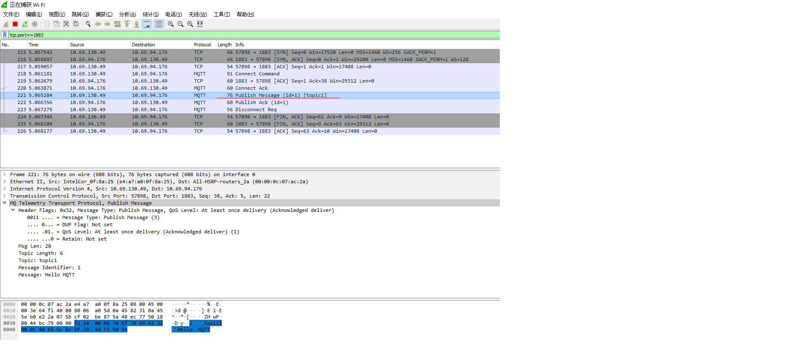

#  MQTT协议 -- 消息报文格式

虽然学习协议是枯燥的，但是熟悉协议本身却是很重要的事情。如果能把其细节弄清楚，并且配合一些实验来学习，就不会那么枯燥了。

### 消息报文格式

MQTT协议是应用层协议，需要借助TCP/IP协议进行传输，类似HTTP协议。MQTT协议也有自己的格式，如下表：

<table>
    <tr>
    	<td colspan=2>Fixed Header</td>
        <td>Variable Header</td>
        <td>Payload</td>
    </tr>
</table>

**Fixed Header:** 固定头部，MQTT协议分很多种类型，如连接，发布，订阅，心跳等。其中固定头是必须的，所有类型的MQTT协议中，都必须包含固定头。

**Variable Header:**可变头部，可变头部不是可选的意思，而是指这部分在有些协议类型中存在，在有些协议中不存在。

**Payload:**消息载体，就是消息内容。与可变头一样，在有些协议类型中有消息内容，有些协议类型中没有消息内容。


---


### 固定头

固定头包含两部分内容，首字节(字节1)和剩余消息报文长度(1-4字节)。

<table>
    <tr>
        <td><b>Bit</b></td>
        <td><b>7</b></td>
        <td><b>6</b></td>
        <td><b>5</b></td>
        <td><b>4</b></td>
        <td><b>3</b></td>
        <td><b>2</b></td>
        <td><b>1</b></td>
        <td><b>0</b></td>
    </tr>
    <tr>
    	<td>字节1</td>
        <td colspan=4>MQTT Control Packet type</td>
        <td colspan=4>Flags specific to each MQTT Control Packet type</td>
    </tr>
    <tr>
    	<td>字节2...</td>
        <td colspan=8>Remaining Length</td>
    </tr>
</table>

为了避免翻译不准确，这里都使用官方的原始术语。其中MQTT Control Packet type可以简单理解为字节位Bit[7-4]用于确定报文类型。Flags specific to each MQTT Control Packet type意思是字节位Bit[3-0]用作某些报文的特殊标记。

##### 首字节

首字节用于表示MQTT消息的报文类型以及某些类型的控制标记，如上图。高4位(bit7~bit4)表示协议类型，总共可以表示16种协议类型，其中0000和1111是保留字段。MQTT消息报文类型如下。

<table>
    <tr>
    	<td><b>报文类型</b></td>
        <td><b>字段值</b></td>
        <td><b>数据方向</b></td>
        <td><b>描述</b></td>
    </tr>
    <tr>
        <td>保留</td>
        <td>0</td>
        <td>禁用</td>
        <td>保留</td>
    </tr>
    <tr>
        <td>CONNECT</td>
        <td>1</td>
        <td>Client---&gtServer</td>
        <td>客户端请求连接到服务器</td>
    </tr>
    <tr>
        <td>CONNACK</td>
        <td>2</td>
        <td>Server---&gtClient</td>
        <td>连接确认</td>
    </tr>
    <tr>
        <td>PUBLISH</td>
        <td>3</td>
        <td>Client&lt---&gtServer</td>
        <td>发布消息</td>
    </tr>
    <tr>
        <td>PUBACK</td>
        <td>4</td>
        <td>Client&lt---&gtServer</td>
        <td>发布确认</td>
    </tr>
    <tr>
        <td>PUBREC</td>
        <td>5</td>
        <td>Client&lt---&gtServer</td>
        <td>消息已接收(可靠性传输第一阶段)</td>
    </tr>
    <tr>
        <td>PUBREL</td>
        <td>6</td>
        <td>Client&lt---&gtServer</td>
        <td>释放消息(可行性传输第二阶段)</td>
    </tr>
    <tr>
        <td>PUBCOMP</td>
        <td>7</td>
        <td>Client&lt---&gtServer</td>
        <td>发布结束(可靠性传输第三阶段)</td>
    </tr>
    <tr>
        <td>SUBSCRIBE</td>
        <td>8</td>
        <td>Client---&gtServer</td>
        <td>客户端订阅请求</td>
    </tr>
    <tr>
        <td>SUBACK</td>
        <td>9</td>
        <td>Server---&gtClient</td>
        <td>订阅确认</td>
    </tr>
    <tr>
        <td>UNSUBSCRIBE</td>
        <td>10</td>
        <td>Client---&gtServer</td>
        <td>客户端订阅请求</td>
    </tr>
    <tr>
        <td>UNSUBACK</td>
        <td>11</td>
        <td>Server---&gtClient</td>
        <td>服务器取消订阅回复</td>
    </tr>
    <tr>
        <td>PINGREQ</td>
        <td>12</td>
        <td>Client---&gtServer</td>
        <td>客户端发送心跳请求</td>
    </tr>
    <tr>
        <td>PINGRESP</td>
        <td>13</td>
        <td>Server---&gtClient</td>
        <td>服务器回复心跳</td>
    </tr>
    <tr>
        <td>DISCONNECT</td>
        <td>14</td>
        <td>Client---&gtServer</td>
        <td>断开连接请求</td>
    </tr>
    <tr>
        <td>保留</td>
        <td>0</td>
        <td>禁用</td>
        <td>保留</td>
    </tr>
</table>


首字节的低4位(bit3~bit0)用来表示某些报文类型的控制字段，实际上只有少数报文类型有控制位，如下图。

<table>
    <tr>
    	<td><b>报文类型</b></td>
        <td><b>固定头标记</b></td>
        <td><b>Bit 3</b></td>
        <td><b>Bit 2</b></td>
        <td><b>Bit 1</b></td>
        <td><b>Bit 0</b></td>
    </tr>
    <tr>
    	<td>CONNECT</td>
        <td>保留</td>
        <td>0</td>
        <td>0</td>
        <td>0</td>
        <td>0</td>
    </tr>
    <tr>
    	<td>CONNACK</td>
        <td>保留</td>
        <td>0</td>
        <td>0</td>
        <td>0</td>
        <td>0</td>
    </tr>
    <tr>
    	<td>PUBLISH</td>
        <td>Used in MQTT 3.1.1</td>
        <td>DUP</td>
        <td>QoS</td>
        <td>QoS</td>
        <td>RETAIN</td>
    </tr>
    <tr>
    	<td>PUBACK</td>
        <td>保留</td>
        <td>0</td>
        <td>0</td>
        <td>0</td>
        <td>0</td>
    </tr>
    <tr>
    	<td>CONNECT</td>
        <td>保留</td>
        <td>0</td>
        <td>0</td>
        <td>0</td>
        <td>0</td>
    </tr>
    <tr>
    	<td>PUBREC</td>
        <td>保留</td>
        <td>0</td>
        <td>0</td>
        <td>0</td>
        <td>0</td>
    </tr>
    <tr>
    	<td>PUBREL</td>
        <td>保留</td>
        <td>0</td>
        <td>0</td>
        <td>1</td>
        <td>0</td>
    </tr>
    <tr>
    	<td>PUBCOMP</td>
        <td>保留</td>
        <td>0</td>
        <td>0</td>
        <td>0</td>
        <td>0</td>
    </tr>
    <tr>
    	<td>SUBSCRIBE</td>
        <td>保留</td>
        <td>0</td>
        <td>0</td>
        <td>1</td>
        <td>0</td>
    </tr>
    <tr>
    	<td>SUBACK</td>
        <td>保留</td>
        <td>0</td>
        <td>0</td>
        <td>0</td>
        <td>0</td>
    </tr>
    <tr>
    	<td>UNSUBSCRIBE</td>
        <td>保留</td>
        <td>0</td>
        <td>0</td>
        <td>1</td>
        <td>0</td>
    </tr>
    <tr>
    	<td>UNSUBACK</td>
        <td>保留</td>
        <td>0</td>
        <td>0</td>
        <td>0</td>
        <td>0</td>
    </tr>
    <tr>
    	<td>PINGREQ</td>
        <td>保留</td>
        <td>0</td>
        <td>0</td>
        <td>0</td>
        <td>0</td>
    </tr>
    <tr>
    	<td>PINGRESP</td>
        <td>保留</td>
        <td>0</td>
        <td>0</td>
        <td>0</td>
        <td>0</td>
    </tr>
    <tr>
    	<td>DISCONNECT</td>
        <td>保留</td>
        <td>0</td>
        <td>0</td>
        <td>0</td>
        <td>0</td>
    </tr>
    <tr>
    	<td>CONNECT</td>
        <td>保留</td>
        <td>0</td>
        <td>0</td>
        <td>0</td>
        <td>0</td>
    </tr>    
</table>


当发布PUBLISH消息时，如果DUP字段(bit 3)设置为1，表明这是一条重复消息，否则是第一次发布消息。为了保证消息的可靠性传递，当QoS设置为1时，客户端或服务器发布消息时，需要得到对方的确认(PUBACK)，如果一段时间后没收到PUBACK，那么会再次发送当前消息，并将DUP字段标记为1。

QoS用来表明QoS等级，如果Bit 1和Bit 2都为0，表示QoS 0。如果Bit 1为1，表示QoS 1。如果Bit 2为1，表示QoS 2。如果同时将Bit 1和Bit 2都设置成1，那么客户端或服务器认为这是一条非法的消息，会关闭当前连接。

目前Bit[3-0]只在PUBLISH协议中使用有效，并且表中指明了是MQTT 3.1.1版本。对于其它MQTT协议版本，内容可能不同。所有固定头标记为"保留"的协议类型，Bit[3-0]必须保持与表中保持一致，如SUBSCRIBE协议，其Bit 1必须为1。如果接收方接收到非法的消息，会强行关闭当前连接。


##### Remaining Length

Remaining Length意思是剩余长度，即Variable Header + Payload的长度。剩余长度从Byte 2开始，最长可达4字节。所以剩余长度范围是Byte[2-5]。那么怎样确定其长度到底是1还是4呢，这取决于字节的最高位Bit 7(默认都是高字节在前)，如果这个值是1，那么就继续计算字节长度，如果是0，那么就不再计算字节长度。

消息长度可以简单理解为128进制的数据，4位长度最大可以表示128\*128\*128\*128Byte=256MB。但是这个长度的计算有些特别，就是低位在前，高位在后(因为正常的表示方法是高位在前，低位在后)，字节最高位Bit7用于标记是否需要继续计算消息长度。以下是消息长度的长度范围：

| 字节 | 最小值                             | 最大值                               |
| ---- | ---------------------------------- | ------------------------------------ |
| 1    | 0(0x00)                            | 127(0x7F)                            |
| 2    | 128 (0x80, 0x01)                   | 16 383 (0xFF, 0x7F)                  |
| 3    | 16 384 (0x80, 0x80, 0x01)          | 2 097 151 (0xFF, 0xFF, 0x7F)         |
| 4    | 2 097 152 (0x80, 0x80, 0x80, 0x01) | 268 435 455 (0xFF, 0xFF, 0xFF, 0x7F) |

稍微注意一下，0x80=1000 0000，不是 1000。刚开始以为是1000，所以就没明白。

举个例子。

消息假设长度是[0X60]，其二进制是01100000，字节最高位Bit7(从左边起第0位)是0，所以不需要继续往后计算。那么消息长度就是0X60，十进制数是96。

如果消息长度是[0XC1, 0XC2, 0X33]，那么他们的二进制分别如下，

0xC1=1100 0001

0xC2=1100 0010

0x33=0011 0011，

第一字节最高位是1，那么需要继续向后计算，去掉标记位(0xC1%128)，得到100 0001=41

第二字节最高位是1，那么需要继续向后计算，去掉标记位(0xC2%128)，得到100 0010=42

第三字节最高位是0，不需要向后计算，其结果就是0x33=51

因为低位在前，高位在后，那么长度计算为Length=41 + 42\*128 + 51\*128\*128=841001 B = 821KB

需要注意的是，消息长度=可变头部长度+消息内容长度。不包括首字节和消息长度本身，如果消息长度为5，那么说明这条消息后边还有5字节，整条消息长度为7(首字节+1位长度字节+5)。

另外如果消息长度为4字节，最后一位不能超过0X7F=127，因为如果超出这个值，其最高位Bit7是1，还需要往后计算，这与消息最大长度为4字节矛盾。所以如果出现[0XFF, 0XFF, 0XFF, 0XFF]这样的消息长度，那么接收方认为这是一条非法的消息。


******

### Variable Header

Variable Header的意思是可变化的消息头部。有些报文类型包含可变头部，如PUBLISH，SUBSCRIBE，CONNECT等等。可变头部在固定头部和消息内容之间，其内容根据报文类型不同而不同。

Packet Identifier(消息ID)是一种常见的可变头部，一个消息ID包含2字节，高字节在前，低字节在后。包含Packet Identifier的协议类型包括：

| 报文类型    | 包含可变头   |
| ----------- | ------------ |
| PUBLISH     | YES(QoS > 0) |
| PUBACK      | YES          |
| PUBREC      | YES          |
| PUBREL      | YES          |
| PUBCOMP     | YES          |
| SUBSCRIBE   | YES          |
| SUBACK      | YES          |
| UNSUBSCRIBE | YES          |
| UNSUBACK    | YES          |

消息ID默认是从1开始并自增，如果一个消息ID被用完后，这个消息ID可以被重用。对于PUBLISH (QoS 1)来说，如果发送端接收到PUBACK，那么这个消息ID就用完了。对于PUBLISH(QoS 2)，如果接收方收到PUBCOMP，那么这个消息ID就用完了。对于SUBSCRIBE和UNSUBSCRIBE，消息ID使用完成的标记是发送方收到了对应的SUBACK和UNSUBACK。

另外客户端和服务端的消息ID是独立分配的，客户端和服务端可以同时使用同一个消息ID。比如

```
	Client                     Server

   PUBLISH Packet Identifier=0x1234--->

   <--PUBLISH Packet Identifier=0x1234

   PUBACK Packet Identifier=0x1234--->

   <--PUBACK Packet Identifier=0x1234
```

上边消息客户端给服务端发送一条消息，使用的消息ID是0x1234，同时服务端给客户端发送了一条消息，也使用了消息ID 0x1234。然后客户端回复服务端，发送PUBACK，最后是客户端收到服务端的回复PUBACK。

另外其它协议如CONNECT和CONNACK也有可变头部，具体请参见[MQTT-Packet CONNECT Variable Header](<http://docs.oasis-open.org/mqtt/mqtt/v3.1.1/os/mqtt-v3.1.1-os.html#_Toc398718030>)


---

### Payload

有些报文类型是包含Payload的，Payload意思是消息载体的意思，如PUBLISH的Payload就是指消息内容。而CONNECT的Payload则包含Client Identifier，Will Topic，Will Message，Username，Password等信息。具体请参见[MQTT-Packet CONNECT Payload](<http://docs.oasis-open.org/mqtt/mqtt/v3.1.1/os/mqtt-v3.1.1-os.html#_Toc398718031>)

包含Payload的报文类型如下：

| 报文类型    | 是否包含Payload |
| ----------- | --------------- |
| CONNECT     | YES             |
| PUBLISH     | 可选            |
| SUBSCRIBE   | YES             |
| SUBACK      | YES             |
| UNSUBSCRIBE | YES             |

除了上面列出的报文类型，其它的报文类型都没有Payload。


### 抓包测试

我们使用Wire Shark抓包，来探测一下MQTT消息内容。

1\. 打开Wireshark，选择你的网卡，添加以下过滤条件，并点击开始捕获。

```
tcp.port==1883
```

2\. 打开终端，输入以下命令，发布一条消息。如果你不理解一下命令，请参看我的前一篇文章[MQTT快速入门](<https://zengbiaobiao.com/article/detail/24>)

```shell
$ mosquitto_pub -d -p 1883 -h 10.69.94.176 -q 1 -t topic1 -m "Hello MQTT"
Client mosqpub|2052-SCNWCL0121 sending CONNECT
Client mosqpub|2052-SCNWCL0121 received CONNACK (0)
Client mosqpub|2052-SCNWCL0121 sending PUBLISH (d0, q1, r0, m1, 'topic1', ... (10 bytes))
Client mosqpub|2052-SCNWCL0121 received PUBACK (Mid: 1)
Client mosqpub|2052-SCNWCL0121 sending DISCONNECT
```

3\.  进入Wireshark捕获窗口，发现捕获到了一些TCP和MQTT协议，如下：



4\. 查看其中一条MQTT消息，比如Publish Message，点击这一行。查看MQTT消息内容。其字节码为

```
32 14 00 06 74 6f 70 69 63 31 00 01 48 65 6c 6c 6f 20 4d 51 54 54
```

5\. 来具体看一下消息内容

- 首字节 0x32=0011 0010，对照首字节中的表，4位高字节为0011=3，表示PUBLISH，4位低字节0010，分别表示DUP 0，QoS 1(占两位)，Retain 0。

- Remaining Length 0x14=20，表示剩余消息长度为20。

- PUBLISH (QoS>0)报文消息包含可变头部，其可变头部包含topic name和Packet Identifier。其格式为：

- 00 06表示topic name的长度，所以topic name长度是6

- 74 6f 70 69 63 31表示topic name的UTF8字符串，其值为"topic1"。

- 00 01是Packet Identifier，所以消息ID为1。

- 48 65 6c 6c 6f 20 4d 51 54 54是Payload，表示“Hello MQTT"的UTF8字节码。


---

 ### 总结

我们介绍了MQTT协议的消息格式，MQTT消息格式包含Fixed Header， Variable Header和Payload。因为MQTT消息格式非常精简，所以可以高效的传输数据。

Fixed Header中包含首字节，高4位用来表示报文类型，低4位用于类型控制。目前只有PUBLISH使用了类型控制字段。其它控制字段被保留并且必须与协议定义保持一致。

Fixed Header同时包含Remaining Length，这是剩余消息长度，最大长度为4字节，理论上一条MQTT最大可以传输256MB数据。Remaining Length=Variable Header+Payload长度。

Variable Header是可变头部，有些报文类型中需要包含可变头部，可变头部根据报文类型不同而不同。比如Packet Identifier在发布，订阅/取消订阅等报文中都使用到。

Payload是消息内容，也只在某些报文类型中出现，其内容和格式也根据报文类型不同而不同。


---

所有文章在[Github](<https://github.com/zengbiaobiao/mqtt>)上同步，你也可以访问我的[个人博客](http://zengbiaobiao.com)点击查看