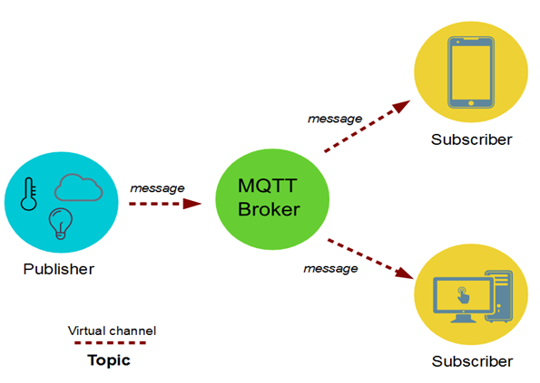

# MQTT 介绍

### 什么是MQTT

MQTT是Message Queuing Telemetry Transport的缩写，它是一个基于发布/订阅模式的轻量级消息中间件协议，IBM公司的Andy Stanford-Clark 和Cirrus Link公司的Arlen Nipper在1999年设计了MQTT协议，最初用于石油管道的远程遥监系统。2010年MQTT发布免费版本，2014年MQTT成为OASIS标准，现在被广泛应用于物联网，移动互联网等领域的数据传输。

MQTT之所以变得流行，是因为它具备以下特点，而这些特点在其它消息传输协议中很难(全部)满足：

- 轻量级，协议简单，容易实现，并且具有很快的传输速度。
- 节省带宽，MQTT协议头只有两个字节，包含数据包类型和一些辅助信息字段，传输效率高，占用带宽少。
- 低功耗， 降低了对设备的硬件要求，不需要很好的CPU，不需要很大的内存，同时省电，这使得MQTT可以运行在大多数的物联网设备(如树莓派)上。
- 实时，MQTT基于TCP/IP进行数据传输，消息传输延迟低。
- 可靠，MQTT协议中定义了消息传输的QoS(Quality of Service)，可以保证消息的可靠传输。即使在网络环境恶劣的情况下(如设备进入地铁，隧道或无信号区域)，也能保证消息不丢失。

### MQTT协议版本

MQTT协议有两个主要的版本，[MQTT 3](http://docs.oasis-open.org/mqtt/mqtt/v3.1.1/os/mqtt-v3.1.1-os.pdf)和[MQTT 5](http://docs.oasis-open.org/mqtt/mqtt/v5.0/cs01/mqtt-v5.0-cs01.pdf)，MQTT 3是当前主要使用的协议版本，大多数MQTT实现都支持该版本。MQTT 5在2018年6月发布，带来了许多令人兴奋的新特性，因为版本比较新，所以对其支持有限，但是相信这种状况将来会慢慢改变。你可以点击[MQTT 3](http://docs.oasis-open.org/mqtt/mqtt/v3.1.1/os/mqtt-v3.1.1-os.pdf)和[MQTT 5](http://docs.oasis-open.org/mqtt/mqtt/v5.0/cs01/mqtt-v5.0-cs01.pdf)分别下载这两个协议的版本。

### MQTT 核心概念

MQTT通过以下方式进行数据交互。

客户端Publisher发送一条消息message给MQTT Broker，发送消息时需要关联一个topic和QoS(Quality of Service)。topic指定了消息要发送给哪个主题，QoS指定了消息可靠性等级(这个在后边会讲到)。假设当前消息发给主题topic1，并且有两个客户端Subscriber分别订阅了topic1。MQTT Broker收到消息后，发现消息是发送给topic1的，于是将这份消息分别转发给它的两个订阅者。

MQTT的核心概念包括：

**Broker**，又称Server，是MQTT的服务端，负责与客户端建立连接，接收并转发消息，接收订阅和取消订阅请求等。

**Client**，使用MQTT协议的程序或设备，负责与Broker建立连接，发送或者接收数据，订阅主题或取消订阅。

**Message**，在MQTT协议中传输的数据，当消息被传输时，通常和一个主题名称(topic name)以及一个QoS(服务质量)关联起来。

**Topic**，主题有两层含义，在发布消息时，主题会和消息关联起来，告诉Broker这条消息要发给哪个主题。在订阅消息时，客户端需要告诉Broker自己对哪个主题感兴趣，一旦有消息发给这个主题，Broker会将消息发给主题的订阅者。主题支持统配符，对于使用通配符的主题，我们成为Topic Filter。

**Publish**，客户端发送消息给Broker的过程。发送消息时需要指定topic和QoS。Broker会将消息转发给订阅了该topic的其它客户端。

**Subscribe**，客户端订阅主题的过程。客户端告诉Broker，自己对某个topic感兴趣，当有其它客户端发送消息给这个topic时，Broker会转发该消息给自己。客户端可以取消订阅，这个过程称作Unsubscribe，取消订阅后，Broker不会再转发消息给当前客户端。

**QoS**，Quality of Service。消息可靠性传递的参数，有3个值，分别是：

- 0，消息只发送一次，不保证发送成功。
- 1，消息最少发送一次，保证发送成功。因为可能发送多次，因此接收方可能收到重复消息。
- 2，消息只发送一次，保证成功。接收方不会接到重复消息。

发送消息时，可以指定QoS，如果QoS>0，那么消息一定会发到Broker。订阅主题时，也可以指定QoS，如果QoS>0，那么Broker一定会将消息发给订阅者，不会丢失。这里要要注意，消息从发布者到订阅者，是分两步走的，第一步有发布者发布到MQTT Broker，第二步是MQTT Broker转发消息到订阅者。所以只有当发布消息时，指定QoS>0，并且订阅主题时，QoS>0，消息才能可靠的从发布客户端发送到订阅客户端端。

### MQTT Server, Client & Tools

MQTT只是一套数据传输协议，要完成数据传输，还需要应用程序来实现它。MQTT实现分为服务端和客户端。MQTT  有很多服务端实现版本，具体请参见[MQTT Server/Brokers](<https://github.com/mqtt/mqtt.github.io/wiki/servers>)，除了收费的版本，用得比较多的应该是[Mosquitto](http://mosquitto.org/)和[EQM](<https://www.emqx.io/>)了。

MQTT 也有很多客户端实现版本，大多数编程语言都有MQTT客户端实现，具体请查看[MQTT Libraries](<https://github.com/mqtt/mqtt.github.io/wiki/libraries>)。这里边比较有名的是Eclipse开发的[Eclipse Paho](<https://www.eclipse.org/paho/>)，Spring Boot中Mqtt默认实现就是使用Paho。

MQTT也提供了一些工具，方便开发测试，具体请参见[MQTT Tools](<https://github.com/mqtt/mqtt.github.io/wiki/tools>)，这里推荐几个比较好用的并且跨平台的工具。

**[MQTT-spy](http://kamilfb.github.io/mqtt-spy/)**，Java版本的客户端工具，提供可视化界面，要求安装JRE/JDK 8u60 以上版本。

**[MQTT Lens](https://chrome.google.com/webstore/detail/mqttlens/hemojaaeigabkbcookmlgmdigohjobjm)**，Chrome插件，方便使用。

**[Mosquitto](<https://mosquitto.org/download/>)**，是MQTT的完整实现，包含了服务端和客户端，它非常轻量级，并且使用简单，所以适合初学者，也有很多公司在产品环境中使用它，不过产品环境的使用配置要多很多。它是基于命令行的，在Linux环境下也很方便使用。

到现在为止，应该对MQTT有一个大致的了解了，下一节我们将体验一下使用MQTT进行数据的发布和订阅。请参见[MQTT快速入门]()。

